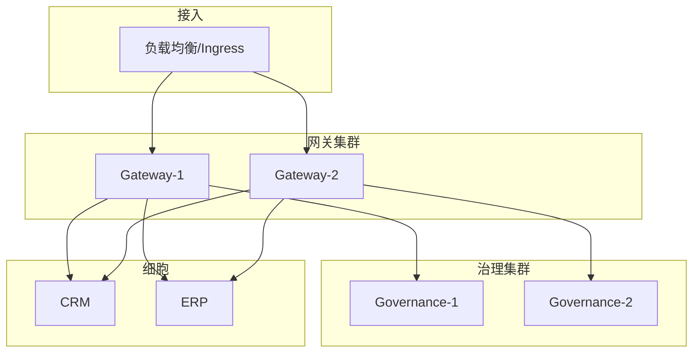

# PaaS 核心层高可用配置指南

**版本**：1.0  
**适用对象**：架构师、运维人员  
**目标**：集群部署、故障转移、容灾备份，提升平台可用性以满足 SLA（如 ≥99.9%）。

---

## 一、高可用架构示意

---

## 二、网关高可用

| 措施 | 说明 |
|------|------|
| 多实例 | 部署 2 个及以上网关实例，前面配置负载均衡（Nginx/HAProxy/K8s Service）；无状态，可水平扩展。 |
| 健康检查 | 负载均衡对网关执行 `GET /health` 健康检查，失败则摘除实例。 |
| 超时与重试 | 配置到细胞的转发超时（如 10–30s）；可配置重试策略（如仅对 5xx 重试 1 次）。 |
| 熔断 | 当前网关支持按细胞的熔断（10s 内 50% 失败则打开），避免雪崩；恢复后可半开探测。 |

**K8s 示例**：Gateway 使用 Deployment replicas≥2，Service 类型 ClusterIP 或配合 Ingress；HPA 可按 CPU/请求量自动扩缩容。

---

## 三、治理中心高可用

| 措施 | 说明 |
|------|------|
| 多实例 | 治理中心若仅做注册与健康巡检，可多实例部署；若有状态（如内存中的细胞列表），需考虑主从或共享存储。 |
| 网关降级 | 网关配置了 CELL_*_URL 时，治理中心不可用仍可直连细胞，仅影响动态发现与健康汇总。 |

---

## 四、故障转移

| 场景 | 建议 |
|------|------|
| 单网关实例宕机 | 负载均衡自动摘除，流量切到其他实例。 |
| 单细胞宕机 | 网关熔断该细胞，其他细胞不受影响；修复后重启细胞，熔断恢复。 |
| 数据库宕机 | 若细胞依赖数据库，需对数据库做高可用（主从、集群）；细胞侧配置连接池与重试。 |

---

## 五、容灾与备份

| 项目 | 说明 |
|------|------|
| 配置备份 | 网关路由、环境变量、治理中心配置定期备份并脱敏存储；恢复时用于快速还原。 |
| 数据备份 | 各细胞数据库按《数据备份/恢复流程》执行；跨机房容灾可做数据库主从/备份到灾备机房。 |
| 演练 | 定期做故障演练（如停止某实例、断网），验证负载均衡与熔断是否符合预期。 |

---

## 六、配置示例（要点）

- **网关多实例**：同一镜像，通过环境变量或配置中心注入 CELL_*_URL、GOVERNANCE_URL；负载均衡健康检查路径 `/health`。
- **生产建议**：GATEWAY_REQUIRE_TENANT_ID=1；GATEWAY_SIGNING_SECRET 与细胞验签密钥一致（若启用）。
- **K8s**：各组件使用 Deployment + Service；网关与治理中心可配置 PodDisruptionBudget，避免同时驱逐过多副本。

---

**文档归属**：商用交付文档包 · PaaS 层  
**维护**：随架构变更更新。
