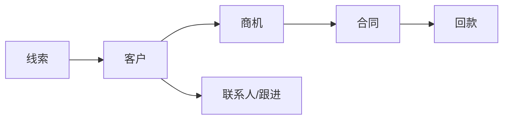

# CRM 商用交付手册

**版本**：1.0  
**细胞名称**：客户关系管理（CRM）  
**适用对象**：交付负责人、运维人员

---

## 一、功能概述

CRM 细胞提供客户全生命周期与销售过程管理，支持：

| 功能模块 | 说明 |
|----------|------|
| 客户管理 | 客户档案、联系人、客户 360 视图、负责人（数据级权限） |
| 商机管理 | 商机创建、阶段推进、赢单/输单、预测与漏斗报表 |
| 合同与回款 | 合同创建、付款记录、与商机关联 |
| 跟进与活动 | 跟进记录、待办活动、活动完成 |
| 线索与转化 | 线索录入、转化为客户/商机 |
| 数据安全 | 手机号/金额脱敏展示；批量导入/导出；按负责人过滤 |

---

## 二、部署流程

| 步骤 | 说明 |
|------|------|
| 1. 镜像与依赖 | 使用项目内 `cells/crm` 构建镜像；依赖见 `cells/crm/requirements.txt`。 |
| 2. 环境变量 | 配置 `PORT`（默认 8001）、`DEFAULT_TENANT_ID`（可选）；若启用验签则配置 `CELL_VERIFY_SIGNATURE=1` 及密钥。 |
| 3. 数据库 | 当前支持 SQLite（内置）；生产可切换 MySQL，执行 `cells/crm/database_schema.sql` 并修改连接配置。 |
| 4. 网关路由 | 网关配置 `CELL_CRM_URL` 指向本细胞（如 http://crm-cell:8001）；经网关访问路径为 `/api/v1/crm/<path>`。 |

**一键部署**：全平台部署时执行 `./deploy/deploy.sh`，CRM 随 crm-cell 服务一起启动；单独部署 CRM 可使用 `./deploy/deploy.sh --only=crm-cell`。

---

## 三、运维流程

| 日常项 | 说明 |
|--------|------|
| 健康检查 | `GET /health` 返回 `{"status":"up","cell":"crm"}`；可通过网关 `/api/v1/crm/health` 或管理端健康汇总查看。 |
| 监控指标 | `GET /metrics` 返回客户总数、商机总数、转化率、漏斗分布等，可供 Prometheus 抓取。 |
| 日志 | 审计日志输出到应用日志（人性化审计）；生产建议将日志集中采集并保留。 |
| 备份 | 若使用 SQLite/MySQL，需定期备份数据库文件或执行 dump；见《超级PaaS平台商用交付总手册》备份流程。 |

---

## 四、监控配置

- **健康**：Prometheus 抓取 `/health`，告警规则：连续失败则告警。
- **业务指标**：抓取 `/metrics`（若暴露），关注客户总量、商机转化率等。
- **响应时间**：通过网关或 APM 统计 `/api/v1/crm/*` 的 P95 延迟。

---

## 五、数据备份

- SQLite：备份 `cells/crm` 目录下数据库文件。
- MySQL：使用 mysqldump 或企业备份工具，备份 CRM 对应库；恢复时执行 schema 及数据导入。

---

**文档归属**：商用交付文档包 · 细胞 · CRM  
**关联**：`cells/crm/docs/CRM商用交付手册.md`、`cells/crm/docs/CRM接口文档（商用版）.md`
