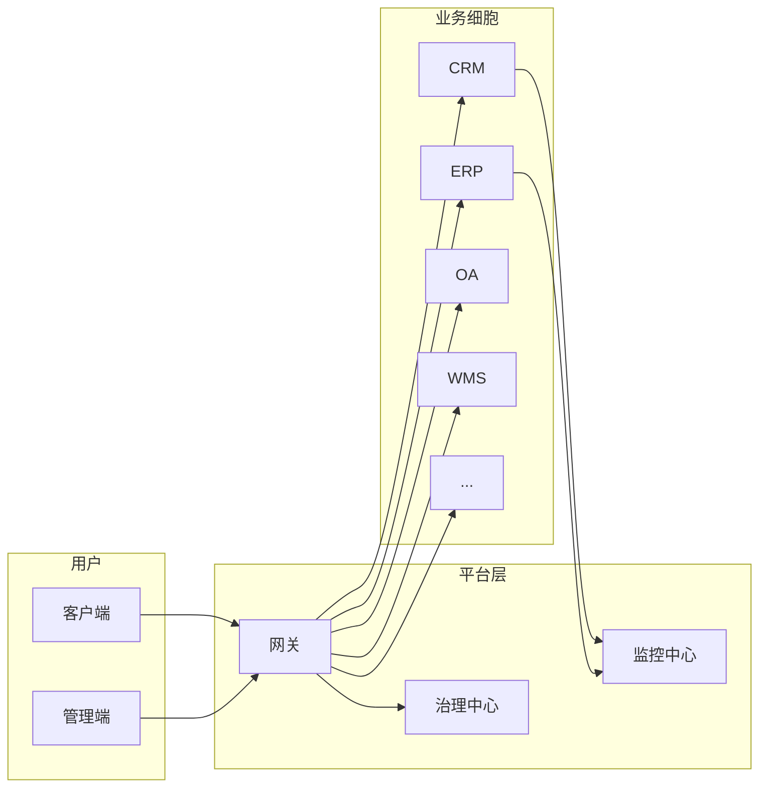
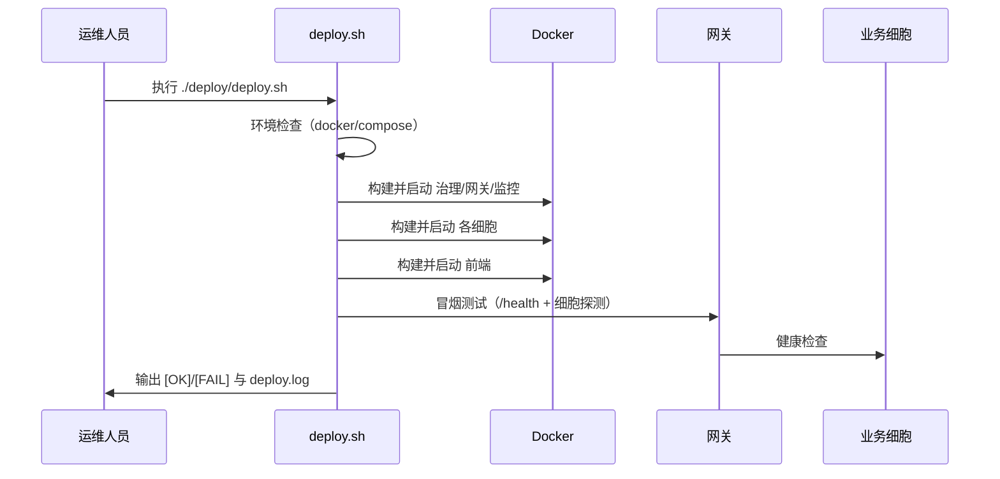

# 超级PaaS平台商用交付总手册

**版本**：1.0  
**适用对象**：企业 IT 管理员、运维人员、项目交付负责人  
**文档类型**：商用级交付总览

---

## 一、项目概述

超级PaaS平台是一套面向企业数字化的一体化平台，采用「平台 + 业务细胞」的架构：平台层负责统一入口、认证、治理与监控，业务细胞（CRM、ERP、OA、仓储、生产、物流、医疗等）独立部署、按需接入，通过标准接口与平台交互，实现**解耦、可扩展、可运维**的商用交付能力。



| 项目要素 | 说明 |
|----------|------|
| 定位 | 企业级 PaaS + 多业务细胞（SaaS 化模块） |
| 部署形态 | Docker / Kubernetes，支持一键部署与增量升级 |
| 租户模型 | 多租户隔离，按租户分配数据与权限 |
| 交付范围 | 平台核心（网关、治理、监控）+ 13 个业务细胞 + 双端前端 |

---

## 二、架构设计（商用版）

### 2.1 总体架构

| 层级 | 组件 | 职责 |
|------|------|------|
| 接入层 | 网关（Gateway） | 统一入口、路由转发、认证校验、请求头透传（租户/用户/请求ID）、熔断与限流 |
| 治理层 | 治理中心（Governance） | 细胞注册与发现、健康巡检、配置下发（可选） |
| 监控层 | 监控中心（Monitor） | 健康汇总、黄金指标采集、与 Prometheus/Grafana 对接 |
| 业务层 | 各 Cell | 独立进程、独立数据存储，仅通过 HTTP 接口与网关交互 |
| 前端 | 客户端 / 管理端 | 用户操作界面、管理配置界面，通过网关访问后端 |

### 2.2 细胞与平台关系

- **无代码依赖**：业务细胞不引用平台代码库，仅通过「HTTP + 标准请求头」与网关通信。
- **独立数据库**：每个细胞可拥有独立数据库或独立 Schema，数据按租户隔离。
- **独立部署**：每个细胞可单独启停、扩缩容，故障隔离。

### 2.3 技术栈

| 类别 | 技术选型 | 说明 |
|------|----------|------|
| 平台核心 | Python / Flask | 网关、治理、监控中心 |
| 业务细胞 | Python（FastAPI / Flask） | CRM 为 FastAPI，其余多为 Flask |
| 前端 | 前端工程（Vue/React 等） | 客户端、管理端 |
| 容器化 | Docker / Docker Compose | 一键部署；可扩展 K8s |
| 监控 | Prometheus / Grafana | 示例配置见 deploy/monitoring |

---

## 三、部署环境要求

| 项目 | 要求 |
|------|------|
| 操作系统 | Linux 推荐；Windows 需 Git Bash 或 WSL 执行部署脚本 |
| Docker | 建议 20.10+，支持 Docker Compose V2 |
| 内存 | 建议 8GB 及以上（全量启动 13 细胞 + 平台） |
| 磁盘 | 建议 20GB 可用空间（镜像与数据） |
| 网络 | 宿主机可访问外网（拉取镜像）；生产建议配置 HTTPS 与防火墙 |

---

## 四、全项目部署流程

### 4.1 Docker 部署（推荐）



**步骤简述**：

1. 进入项目根目录，复制环境配置：`cp deploy/.env.example deploy/.env`（按需修改端口与细胞 URL）。
2. 执行一键部署：`./deploy/deploy.sh`（或 `sh deploy/deploy.sh`）。脚本将依次：环境检查 → 构建并启动治理中心、网关、监控 → 启动各细胞 → 启动双端前端 → 执行冒烟测试。
3. 查看日志：`deploy/deploy.log`，确认各步骤为 `[OK]`。
4. 访问：网关 http://localhost:8000/health，客户端 http://localhost:5173，管理端 http://localhost:5174。

**增量部署**（仅更新部分服务）：

```bash
./deploy/deploy.sh --only=gateway,crm-cell
./deploy/deploy.sh --only=frontend --skip-build
```

### 4.2 仅 Docker Compose（无脚本）

```bash
cd deploy
docker compose --env-file .env up -d
```

服务与端口以 `deploy/docker-compose.yml` 及 `.env` 为准，详见 `deploy/README.md`。

### 4.3 Kubernetes 部署

当前交付以 Docker Compose 为主；K8s 部署可将各服务转为 Deployment/Service，网关与治理中心通过 Service 发现细胞。具体清单与示例 YAML 可根据客户环境另行提供，部署流程与「无状态服务 + 配置/密钥外置」标准一致。

---

## 五、升级与回滚流程

| 场景 | 操作 |
|------|------|
| 升级某细胞 | 更新该细胞镜像或代码后，执行 `./deploy/deploy.sh --only=<细胞服务名> --skip-build` 或重新 build 后 `--only=<细胞服务名>`。 |
| 升级网关/治理/监控 | `./deploy/deploy.sh --only=gateway` 或 `governance` / `monitor`，必要时先备份配置与路由。 |
| 回滚 | 使用上一版本镜像或代码重新构建并执行 `--only=对应服务`；若已备份数据库，按《数据备份/恢复流程》恢复数据。 |
| 全量回滚 | 保留上一版本部署包与镜像标签，整体回退到上一版本 compose 或 K8s 配置，并恢复数据备份（如有）。 |

---

## 六、日常运维流程

| 日常项 | 频率 | 说明 |
|--------|------|------|
| 健康检查 | 每日或按监控周期 | 查看网关 /health、管理端「健康汇总」或 Prometheus 告警，确认各细胞与平台状态。 |
| 日志巡检 | 每日 | 查看各服务日志，关注 ERROR/WARN；若有集中日志（如 ELK），按关键字检索。 |
| 备份执行 | 按策略（如每日） | 执行 `deploy/scripts/backup.sh`（或客户定制脚本），将备份文件归档到安全存储。 |
| 容量与性能 | 每周/月 | 查看磁盘、内存、接口响应时间与错误率，必要时扩容或优化（见《商用化性能优化建议》）。 |
| 安全与合规 | 按企业策略 | 检查密钥与配置权限、审计日志完整性、脱敏与权限是否符合《安全合规手册》。 |

---

## 七、监控告警配置

- **健康**：网关 `/health`、治理中心 `/api/governance/health`、各细胞 `/health`；管理端可调用网关 `/api/admin/health-summary` 查看细胞健康汇总。
- **指标**：监控中心暴露黄金指标；Prometheus 示例配置见 `deploy/monitoring/prometheus.example.yml`，抓取网关、治理、监控中心及各细胞 `/health` 或 `/metrics`（若细胞支持）。
- **Grafana**：可基于 Prometheus 数据源配置大盘与告警（响应时间、错误率、可用性）。
- **告警规则**：示例见 `deploy/monitoring/alerts.example.yaml`；建议至少对「服务不可用」「5xx 率超阈值」「响应时间 P95 超 500ms」配置告警并通知运维。

---

## 八、故障处理手册

| 现象 | 可能原因 | 处理建议 |
|------|----------|----------|
| 网关返回 502/503 | 下游细胞未启动或超时 | 检查该细胞容器/进程与日志；重启细胞或扩容。 |
| 某细胞 /health 失败 | 细胞异常退出或依赖（如 DB）不可用 | 查看细胞日志与依赖服务；修复后重启细胞。 |
| 请求返回「租户缺失」 | 未传 X-Tenant-Id 且生产开启了强制租户 | 在请求头中携带正确 X-Tenant-Id。 |
| 重复提交导致重复数据 | 未传 X-Request-ID 或细胞未实现幂等 | 写操作携带 X-Request-ID；确认细胞幂等逻辑生效。 |
| 前端无法访问接口 | 网关或前端代理配置错误 | 确认网关端口、前端 API 代理地址与 CORS。 |

详细故障处理可结合《PaaS核心层商用运维手册》与各细胞《管理员手册》。

---

## 九、数据备份与恢复流程

- **备份**：执行 `deploy/scripts/backup.sh`（生产需按实际数据库与路径修改脚本）。建议每日全量备份，保留周期按企业策略（如 7 天）；配置与密钥脱敏后单独备份。
- **恢复**：停止相关服务 → 从备份恢复数据库（如 gunzip \< xxx.sql.gz \| mysql ...）→ 恢复配置与密钥 → 启动服务 → 执行健康检查与核心业务流程验证。

详见 `deploy/scripts/backup_example.md` 与《商用化问题整改清单》中的备份脚本说明。

---

## 十、SLA（服务等级协议）

| 指标 | 承诺 |
|------|------|
| 可用性 | 平台与已接入细胞合计可用性 ≥ 99.9%（按月统计，不含计划内停机与客户侧原因）。 |
| 响应时间 | 核心查询接口 P95 ≤ 500ms；写入接口 P95 ≤ 1s（单机、常规负载下）。 |
| 维保内容 | 提供版本升级与缺陷修复、文档与配置更新、故障排查指导；不包含客户定制开发与第三方系统改造。 |
| 免责 | 因客户环境、网络、第三方依赖、未按文档操作导致的故障与数据问题，不纳入 SLA 违约。 |

具体 SLA 条款以商务合同为准，本文档仅作技术参考。

---

## 十一、售后支持流程

1. **问题反馈**：客户通过约定渠道（工单/邮件/电话）提交问题，需提供：现象描述、环境（如版本、部署方式）、复现步骤、相关日志或截图。
2. **分级处理**：P0（业务不可用）优先响应与处理；P1（功能异常）按 SLA 响应；P2（优化与咨询）按资源安排。
3. **闭环**：提供解决方案或补丁后，由客户验证并确认关闭；必要时提供《故障处理手册》或《管理员手册》中的操作指引。

---

## 十二、常见问题（FAQ）

| 问题 | 回答 |
|------|------|
| 如何新增一个租户？ | 在多租户体系中，租户由业务或认证系统分配；调用接口时在请求头中携带该租户的 X-Tenant-Id。具体见《多租户配置指南》。 |
| 如何只部署部分细胞？ | 使用 `./deploy/deploy.sh --only=gateway,crm-cell,erp-cell` 仅启动指定服务。 |
| 生产环境是否必须用 HTTPS？ | 建议是。请在网关前配置 TLS 终结（如 Nginx/负载均衡），或由网关配置 HTTPS。 |
| 细胞数据存在哪里？ | 当前部分细胞为内存存储（重启丢失）；生产需切换为 MySQL/PostgreSQL 等持久化存储，见各细胞《商用交付手册》与《商用化问题整改清单》。 |
| 如何查看某细胞的接口文档？ | 通过管理端或直接访问网关代理：`/api/admin/cells/<cell_id>/docs`（需携带 Authorization）。CRM 等支持 OpenAPI 的细胞可在此查看 Swagger。 |

---

**文档归属**：超级PaaS平台交付文档包 · 总交付文档  
**维护**：随版本与部署方式更新，以最新版为准。
