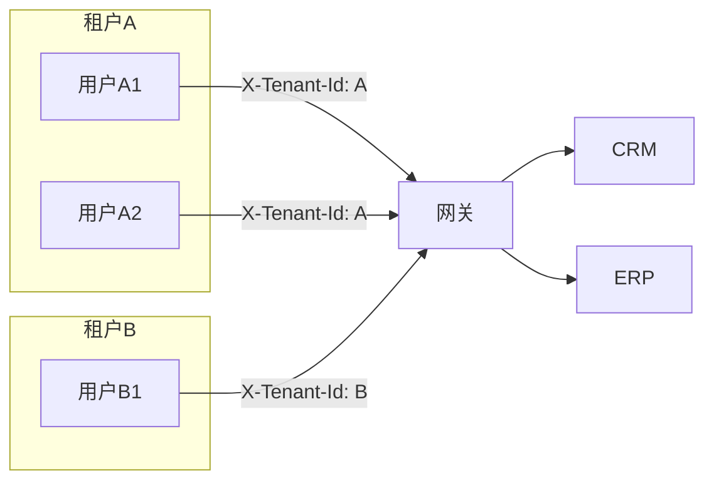

# 超级PaaS平台多租户配置指南

**版本**：1.0  
**适用对象**：企业 IT 管理员、实施人员  
**目标**：租户创建、权限分配、数据隔离配置，确保多租户安全可用。

---

## 一、多租户模型说明



- **租户**：代表一家企业或一个业务单元；所有业务数据按租户隔离。
- **请求标识**：每次请求在 HTTP 头中携带 `X-Tenant-Id`，网关与各细胞据此过滤数据，保证「租户 A 看不到租户 B 的数据」。

---

## 二、租户创建与分配

| 步骤 | 说明 |
|------|------|
| 1. 确定租户 ID | 由运营或管理员分配唯一租户标识（如 `tenant-001`、`company-acme`），需与业务或认证系统一致。 |
| 2. 用户与租户绑定 | 在认证系统或网关侧用户列表中，将用户与允许的租户关联；用户登录后，前端或网关在请求中注入该用户的租户 ID。 |
| 3. 细胞侧生效 | 各细胞从请求头读取 `X-Tenant-Id`，仅查询、写入该租户下的数据；无需在细胞内再建「租户表」即可实现逻辑隔离（若细胞已实现按 tenant_id 过滤）。 |

当前交付中，租户 ID 的「创建」多为业务侧或配置侧行为（如写入配置库、认证系统）；平台侧不强制提供「租户 CRUD 界面」，可由管理端或独立运营系统扩展。

---

## 三、权限分配

| 层级 | 说明 |
|------|------|
| 网关/认证 | 用户登录后获得 token 及 `allowedCells`（可访问的细胞列表）；网关可根据 token 校验是否允许访问某细胞路径。 |
| 细胞内 | 部分细胞支持「数据级」权限：通过请求头 `X-User-Id` 识别当前用户，仅返回该用户负责的数据（如 CRM 客户负责人、HIS 医生患者、LIS 检验师样本）。 |

**配置示例**（管理端或配置库）：

- 用户 `operator1`：角色「销售」，allowedCells：`crm,erp`，绑定租户 `tenant-001`。
- 用户 `doctor1`：角色「医生」，allowedCells：`his,lis`，绑定租户 `tenant-hospital`。

---

## 四、数据隔离配置

| 项目 | 配置要点 |
|------|----------|
| 网关 | 生产环境建议设置 `GATEWAY_REQUIRE_TENANT_ID=1`，强制请求携带 `X-Tenant-Id`，否则返回 400。 |
| 细胞 | 各细胞从 `request.headers.get("X-Tenant-Id")` 读取租户，默认值可为 `default`（仅用于开发/测试）；生产应禁止使用默认租户或仅允许白名单。 |
| 数据库 | 若多租户共库，表中需有 `tenant_id` 字段，所有查询带 `WHERE tenant_id = ?`；若一租户一库，则通过数据源或 Schema 隔离。 |

---

## 五、对接示例

**前端请求**（登录后）：

```http
GET /api/v1/crm/customers?page=1&pageSize=20
Authorization: Bearer <token>
X-Tenant-Id: tenant-001
Content-Type: application/json
```

**后端**：网关透传 `X-Tenant-Id` 到细胞；细胞仅返回 `tenant_id = tenant-001` 的客户数据。

---

## 六、常见问题

| 问题 | 处理 |
|------|------|
| 返回「缺少租户标识」 | 请求头未带 `X-Tenant-Id` 且生产开启了强制租户；由前端或网关在登录后注入租户 ID。 |
| 看到其他租户数据 | 属严重问题：检查细胞是否在所有查询中使用了 `tenant_id` 过滤；审计日志排查越权访问。 |
| 新租户如何开通 | 在认证/配置系统中新增租户 ID 并分配合适用户与细胞权限；无需重启平台。 |

---

**文档归属**：商用交付文档包 · 通用  
**维护**：随多租户能力增强更新。
