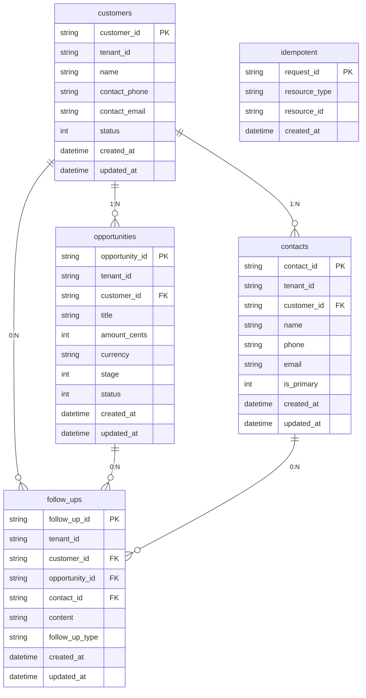

# CRM 细胞档案

**文档版本**：V2.0  
**细胞名称**：CRM（客户关系管理）  
**所属领域**：通用企业管理  
**约束文档**：《01_【核心法律】基础与AI安全宪法》《接口设计说明书》《数据库设计说明书》《超级PaaS平台逻辑全景图》  
**档案性质**：模块开发与接入校验唯一依据

---

## 1. 模块身份卡

| 项 | 值 |
|----|-----|
| **细胞 ID** | `crm` |
| **显示名称** | 客户关系管理（CRM） |
| **核心职责** | 客户、联系人、商机、跟进记录的完整生命周期管理；提供客户 360° 视图与商机 pipeline；与平台仅经标准化 HTTP 接口与事件交互。 |
| **业务边界** | 本细胞负责：客户主数据、联系人归属客户、商机归属客户与阶段、跟进记录关联客户/商机/联系人。**不负责**：订单、合同、财务（属 ERP 等细胞）；跨细胞数据仅通过事件或平台转发接口获取，禁止跨细胞库直连。 |
| **独立部署单元** | 是（独立进程/容器，可独立扩缩容） |
| **独立数据库** | 是（本细胞独享库/Schema，禁止与其他细胞共享或直连） |
| **技术栈** | Python 3.x、FastAPI、Uvicorn、SQLite/可替换 RDBMS |
| **档案状态** | 已归档，可用于开发与接入校验 |

---

## 2. 细胞膜规范

### 2.1 基础约定（对齐《接口设计说明书》）

- **协议**：HTTPS（开发可 HTTP）  
- **数据格式**：JSON  
- **字符编码**：UTF-8  
- **版本前缀**：经网关暴露时为 `/api/v1/crm`（Base Path 不可单方变更）  
- **必须请求头**：`Content-Type: application/json`、`Authorization: Bearer <token>`、`X-Request-ID`（POST/PATCH/PUT 必填，用于幂等）  
- **必须响应头**：`Content-Type: application/json`、`X-Response-Time`（毫秒）  
- **多租户**：请求头 `X-Tenant-Id`，缺省时使用细胞配置默认租户  

### 2.2 统一错误响应格式（《接口设计说明书》3.1.3）

```json
{
  "code": "ERROR_CODE",
  "message": "错误描述",
  "details": "详细信息（可选）",
  "requestId": "请求ID"
}
```

| 错误码 | HTTP 状态 | 说明 |
|--------|-----------|------|
| BAD_REQUEST | 400 | 参数错误或缺少 X-Request-ID（POST/PATCH） |
| UNAUTHORIZED | 401 | 未提供或无效 Authorization |
| NOT_FOUND | 404 | 资源不存在 |
| IDEMPOTENT_CONFLICT | 409 | 同 X-Request-ID 已存在资源 |
| INTERNAL_ERROR | 500 | 服务端错误 |

### 2.3 对外提供的 API 清单

以下为**当前实现并承诺稳定**的接口；完整 OpenAPI 见 `cells/crm/api_contract.yaml`。

#### 健康检查（网关注册与治理巡检必用）

| 方法 | 路径 | 说明 | 响应示例 |
|------|------|------|----------|
| GET | `/health` | 健康检查，无鉴权 | `{"status":"up","cell":"crm"}` |

#### 客户（customers）

| 方法 | 路径 | 说明 | 请求体/查询 | 响应 |
|------|------|------|-------------|------|
| GET | `/customers` | 列表（分页） | query: `page`, `pageSize` | `{ "data": [...], "total": N }` |
| GET | `/customers/{customer_id}` | 详情 | — | Customer 对象 |
| POST | `/customers` | 创建（幂等） | Header: `X-Request-ID`；Body: CustomerCreate | 201 + Customer |
| PATCH | `/customers/{customer_id}` | 更新（幂等） | Header: `X-Request-ID`；Body: CustomerUpdate | Customer |
| DELETE | `/customers/{customer_id}` | 删除 | — | 204 |

- **CustomerCreate**：`{ "name": string, "contactPhone"?: string, "contactEmail"?: string }`  
- **CustomerUpdate**：`{ "name"?: string, "contactPhone"?: string, "contactEmail"?: string }`  
- **Customer**：`customerId`, `tenantId`, `name`, `contactPhone`, `contactEmail`, `status`, `createdAt`, `updatedAt`  

#### 联系人（contacts）

| 方法 | 路径 | 说明 | 请求体/查询 | 响应 |
|------|------|------|-------------|------|
| GET | `/contacts` | 列表（分页） | query: `customerId`, `page`, `pageSize` | `{ "data": [...], "total": N }` |
| GET | `/contacts/{contact_id}` | 详情 | — | Contact 对象 |
| POST | `/contacts` | 创建（幂等） | Header: `X-Request-ID`；Body: ContactCreate | 201 + Contact |
| PATCH | `/contacts/{contact_id}` | 更新（幂等） | Header: `X-Request-ID`；Body: ContactUpdate | Contact |
| DELETE | `/contacts/{contact_id}` | 删除 | — | 204 |

- **ContactCreate**：`{ "customerId": string, "name": string, "phone"?: string, "email"?: string, "isPrimary"?: bool }`  
- **Contact**：`contactId`, `tenantId`, `customerId`, `name`, `phone`, `email`, `isPrimary`, `createdAt`, `updatedAt`  

#### 商机（opportunities）

| 方法 | 路径 | 说明 | 请求体/查询 | 响应 |
|------|------|------|-------------|------|
| GET | `/opportunities` | 列表（分页） | query: `customerId`, `page`, `pageSize` | `{ "data": [...], "total": N }` |
| GET | `/opportunities/{opportunity_id}` | 详情 | — | Opportunity 对象 |
| POST | `/opportunities` | 创建（幂等） | Header: `X-Request-ID`；Body: OpportunityCreate | 201 + Opportunity |
| PATCH | `/opportunities/{opportunity_id}` | 更新（幂等） | Header: `X-Request-ID`；Body: OpportunityUpdate | Opportunity |
| DELETE | `/opportunities/{opportunity_id}` | 删除 | — | 204 |

- **OpportunityCreate**：`{ "customerId": string, "title": string, "amountCents"?: int, "currency"?: string, "stage"?: int }`  
- **Opportunity**：`opportunityId`, `tenantId`, `customerId`, `title`, `amountCents`, `currency`, `stage`, `status`, `createdAt`, `updatedAt`  

#### 跟进记录（follow-ups）

| 方法 | 路径 | 说明 | 请求体/查询 | 响应 |
|------|------|------|-------------|------|
| GET | `/follow-ups` | 列表（分页） | query: `customerId`, `opportunityId`, `page`, `pageSize` | `{ "data": [...], "total": N }` |
| GET | `/follow-ups/{follow_up_id}` | 详情 | — | FollowUp 对象 |
| POST | `/follow-ups` | 创建（幂等） | Header: `X-Request-ID`；Body: FollowUpCreate | 201 + FollowUp |
| PATCH | `/follow-ups/{follow_up_id}` | 更新（幂等） | Header: `X-Request-ID`；Body: FollowUpUpdate | FollowUp |
| DELETE | `/follow-ups/{follow_up_id}` | 删除 | — | 204 |

- **FollowUpCreate**：`{ "content": string, "customerId"?: string, "opportunityId"?: string, "contactId"?: string, "followUpType"?: string }`  
- **FollowUp**：`followUpId`, `tenantId`, `customerId`, `opportunityId`, `contactId`, `content`, `followUpType`, `createdAt`, `updatedAt`  

### 2.4 依赖的 PaaS 平台 API 清单

| 能力 | 说明 | 调用方式 |
|------|------|----------|
| **认证** | 平台统一认证（OAuth 2.0 + JWT）；网关转发时携带 `Authorization`，细胞校验 Token 或委托平台校验 | 请求头 `Authorization: Bearer <token>`；可选调用 `PLATFORM_AUTH_URL` 校验 |
| **租户上下文** | 多租户隔离，网关注入 `X-Tenant-Id` | 请求头 `X-Tenant-Id` |
| **网关路由** | 请求经网关转发至本细胞，路径为 `/api/v1/crm/...` | 由平台配置，细胞无需主动调用 |
| **治理中心** | 注册发现、健康巡检、链路与指标上报（可选） | 治理中心拉取本细胞 `GET /health`；网关可向治理上报 trace/metrics |
| **事件总线** | 发布/订阅领域事件（异步协作） | 按《接口设计说明书》3.2 事件结构；当前可为占位，后续对接 Kafka/RabbitMQ |

本细胞**不直接依赖** platform_core 代码库，仅通过标准化 HTTP 与平台交互。

---

## 3. 细胞核规范

### 3.1 核心数据模型 ER 图



### 3.2 数据库设计规范（对齐《数据库设计说明书》）

- **细胞隔离**：本细胞使用独立数据库实例或独立 Schema，不与 ERP、WMS 等细胞共享库。  
- **租户隔离**：所有业务表含 `tenant_id`，查询/写入均按 `tenant_id` 过滤。  
- **敏感数据**：手机号、邮箱等按《敏感数据加密与脱敏规范》存储与展示（存储可加密、界面与日志动态脱敏）。  
- **审计**：写操作建议记录 `trace_id`、操作人、人类可读描述；审计日志留存周期按平台约定（如 180 天）。  
- **幂等**：`idempotent` 表按 `request_id` 记录 POST/PATCH 已处理请求，避免重复提交。  

#### 表结构摘要（与当前实现一致）

| 表名 | 说明 |
|------|------|
| customers | 客户主数据，tenant_id + customer_id 唯一 |
| contacts | 联系人，归属 customer_id |
| opportunities | 商机，归属 customer_id，含 stage/amount_cents |
| follow_ups | 跟进记录，可关联 customer_id/opportunity_id/contact_id |
| idempotent | 幂等键：request_id → resource_type + resource_id |

索引要求：`tenant_id`、外键字段（如 `customer_id`）、`created_at` 等查询条件建索引，与 `database.py` 中 `CREATE INDEX` 一致。

---

## 4. 接入校验清单

以下为模块接入平台时的**必填检查项**，用于自检与平台侧验收；合规标准依据《接口设计说明书》《01_核心法律》第七部分。

### 4.1 解耦与边界

| 检查项 | 合规标准 | 自检结果 |
|--------|----------|----------|
| 无 PaaS 代码依赖 | 细胞代码不 import platform_core，不直连平台库 | ✓ 仅 HTTP/环境变量与平台交互 |
| 独立数据库 | 细胞独享库/Schema，不连接其他细胞库 | ✓ 独立 SQLite/可替换 RDBMS |
| 跨细胞禁止直连 | 与 ERP、OA 等仅通过事件或平台转发接口 | ✓ 无跨细胞 DB/直连 HTTP |

### 4.2 细胞膜（接口）合规

| 检查项 | 合规标准 | 自检结果 |
|--------|----------|----------|
| 健康检查 | 提供 `GET /health`，返回 status/cell，供网关注册与治理巡检 | ✓ 返回 `{"status":"up","cell":"crm"}` |
| 认证能力 | 业务接口校验 Authorization 或委托平台校验 | ✓ require_auth 依赖校验 |
| 统一错误体 | 4xx/5xx 响应体含 code、message、details、requestId | ✓ 全局异常处理统一格式 |
| 必填请求头 | POST/PATCH 要求 X-Request-ID，缺失返回 400 | ✓ 已实现 |
| 响应头 | 响应含 X-Response-Time | ✓ 中间件注入 |
| 幂等 | POST/PATCH 按 X-Request-ID 幂等，重复返回 409 | ✓ idempotent 表 + 409 |

### 4.3 数据与安全

| 检查项 | 合规标准 | 自检结果 |
|--------|----------|----------|
| 多租户 | 请求带 X-Tenant-Id，读写按 tenant_id 隔离 | ✓ tenant_id_ctx + 所有查询带 tenant_id |
| 敏感字段 | 手机/邮箱等按规范脱敏展示与存储 | 按《敏感数据加密与脱敏规范》配置 |

### 4.4 交付物

| 检查项 | 合规标准 | 自检结果 |
|--------|----------|----------|
| delivery.package | 存在且含 cell_name、status、version、completion_manifest | ✓ cells/crm/delivery.package |
| completion.manifest | 列出已交付能力 | ✓ cells/crm/completion.manifest |
| api_contract.yaml | OpenAPI 3.0，与实现一致 | ✓ cells/crm/api_contract.yaml |
| 单元/交付测试 | 通过 verify_delivery 脚本 | ✓ scripts/verify_delivery.py |

接入时需在**网关/治理**配置本细胞路由与健康检查地址（如 `CELL_CRM_URL`），无需修改平台级架构文档。

---

## 5. 部署与运维规范

### 5.1 独立部署要求

- **进程/容器**：本细胞以独立进程（如 `uvicorn`）或独立容器运行，端口由环境变量配置（如 `PORT` 或 `CRM_PORT`）。  
- **配置**：数据库连接、租户默认值、可选认证 URL 等通过环境变量注入，不写死在代码中。  
- **一键编排**：支持通过 `deploy/docker-compose.yml` 与网关、治理、监控等一起启动；细胞镜像构建见 `cells/crm/Dockerfile`。  

### 5.2 日志规范

- **格式**：建议结构化（如 JSON），包含 `trace_id`/`request_id`、`tenant_id`、时间戳、级别。  
- **级别**：ERROR 记录异常与失败请求；WARNING 记录鉴权失败、幂等冲突等；INFO 可记录请求路径与耗时。  
- **敏感信息**：日志中不输出完整手机号、身份证等，按《敏感数据加密与脱敏规范》脱敏。  
- **与平台联动**：验签失败、熔断等按《部署与运维规范》输出到约定位置，便于告警联动。  

### 5.3 监控指标要求

- **健康**：治理中心或网关定时拉取 `GET /health`，失败 N 次可标记不健康并隔离流量。  
- **RED 指标**：请求量（Request count）、错误率（Error rate）、耗时（Duration）由网关/治理侧汇聚，细胞侧可透出 `X-Response-Time`，并支持 trace_id 串联。  
- **业务可选**：如商机阶段分布、跟进数量等可由细胞自行暴露指标或由平台通过 API 聚合。  

### 5.4 运维入口

| 用途 | 入口 |
|------|------|
| 本地运行 | `cells/crm/run.py` 或 `uvicorn src.main:app --host 0.0.0.0 --port <PORT>` |
| 镜像构建 | `cells/crm/Dockerfile` |
| 交付校验 | `cells/crm/scripts/verify_delivery.py` 或项目根 `./run.sh verify crm`、`./scripts/verify_delivery.sh crm` |

---

## 6. 事件与扩展（可选）

### 6.1 事件命名与结构（《接口设计说明书》3.2）

- **事件域**：`crm`  
- **命名**：`crm.[Entity].[Action]`  
- **结构**：`eventId`、`eventType`、`timestamp`、`source`（固定 `crm`）、`traceId`、`data`  

#### 本细胞可发布事件（示例）

| eventType | 说明 |
|-----------|------|
| crm.customer.created | 客户创建完成 |
| crm.customer.updated | 客户信息变更 |
| crm.opportunity.created | 商机创建 |
| crm.opportunity.closed | 商机关闭（赢单/输单） |

#### 本细胞可订阅事件（异步协作，禁止同步强一致）

| 订阅 eventType | 来源 | 用途示例 |
|----------------|------|----------|
| erp.contract.signed | ERP | 合同签约后同步商机/客户状态 |
| oa.task.completed | OA | 跟进任务完成更新活动记录 |

---

## 7. 合规声明

- 本细胞遵守《01_【核心法律】基础与AI安全宪法》第七部分：细胞自治、跨细胞访问禁令、跨细胞同步调用禁令、事件语义冻结。  
- 本细胞遵守《接口设计说明书》：集装箱原则（接口契约不可变）、玻璃房原则（可追溯）、零心智负担原则（≤3 层操作）；熔断、优雅降级、POST/PATCH 幂等（X-Request-ID）。  
- 本细胞遵守《数据库设计说明书》：细胞隔离、租户隔离、敏感数据加密与脱敏、审计要求。  
- 接入/下线本细胞**不需要**修改平台级架构文档，仅需在平台侧注册/注销路由与健康检查地址。  

---

**编制**：SuperPaaS-God v8.0  
**归档日期**：按项目细胞档案规范维护；本文档可直接用于 CRM 模块开发与接入校验。
