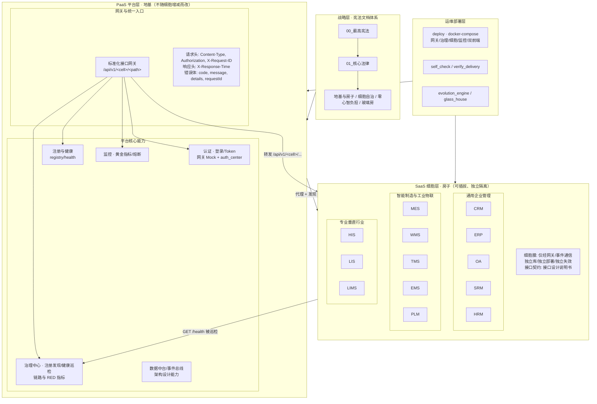
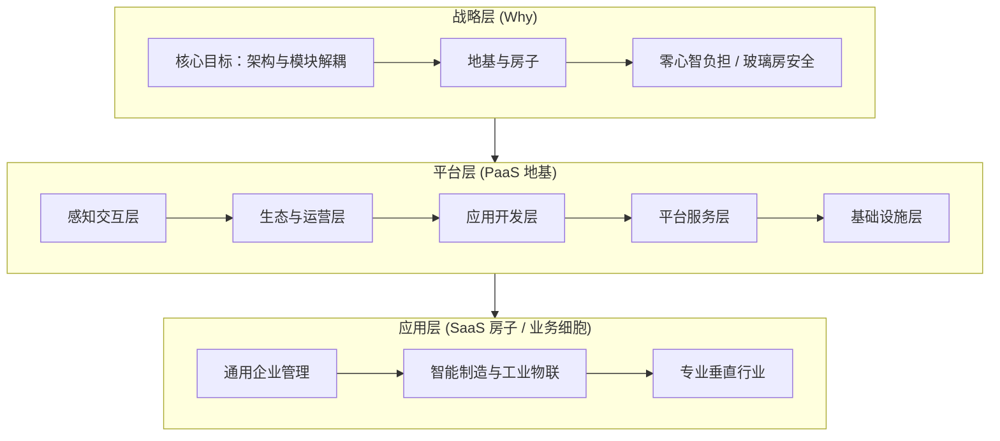
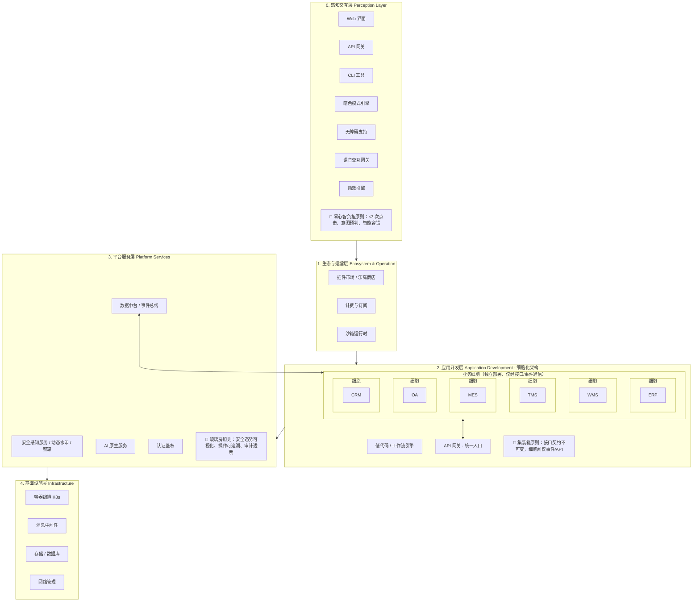
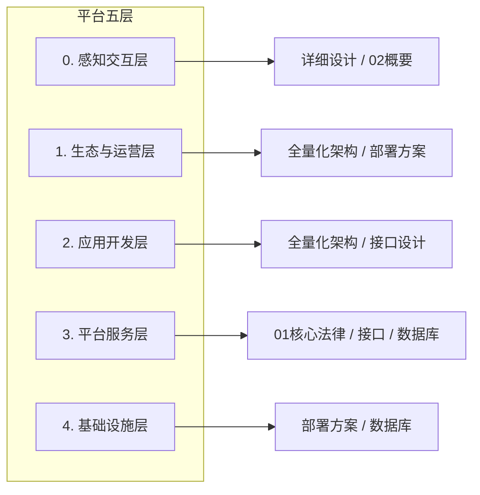
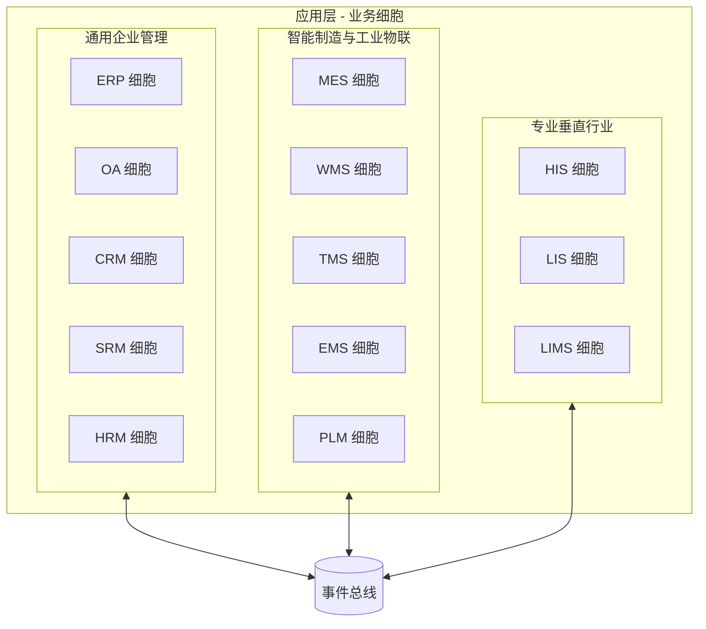
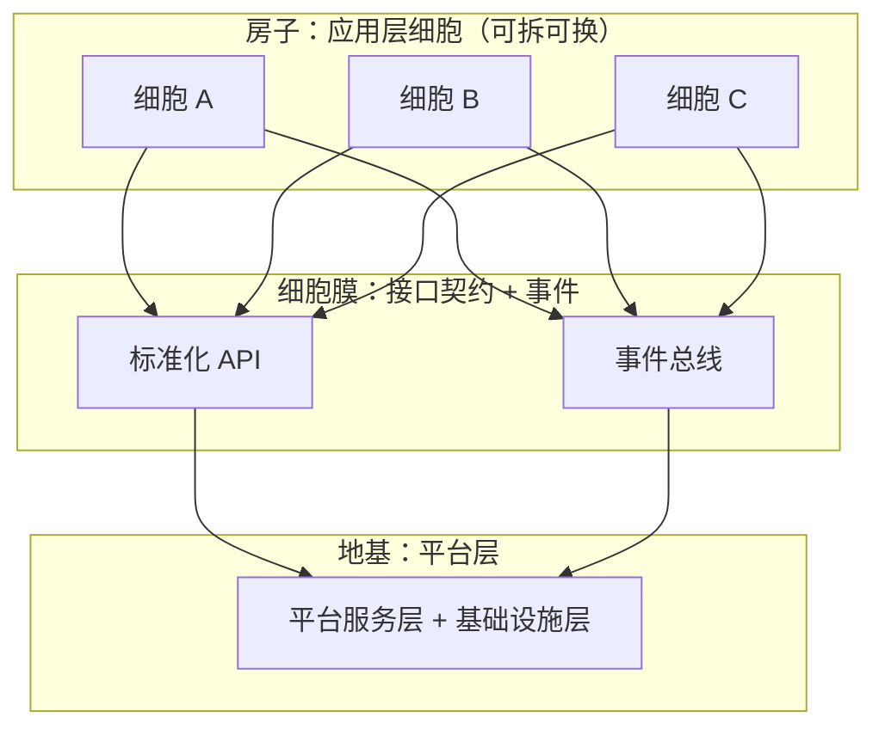

# 超级 PaaS 平台逻辑全景图

**文档版本**：V1.2  
**文档性质**：导航地图（Navigation Map）  
**权威依据**：《00_【最高宪法】SuperPaaS-God v8.0》《01_【核心法律】基础与AI安全宪法_V3.0》；非正式上下文见 glass_house/项目上下文摘要.txt  
**编制角色**：SuperPaaS-God v8.0（最高统帅 / CXO / 安全守望者）

---

## 1. 文档定位与用途

本图是**整个项目的唯一导航地图**，用于：

- **战略与平台分离**：清晰区分“为什么做”（战略层）与“做什么/怎么做”（平台层、应用层）。
- **解耦验证**：证明 PaaS 为“地基”、业务模块为“房子”，地基不随房子拆建而改动；细胞模块独立隔离，仅经标准化接口与事件与平台交互。
- **文档寻址**：快速定位某一层级、某一模块应由哪份文档约束（见 §10 全项目文档导航、§11 模块导航）。
- **接入与扩展**：新细胞接入时，按本图找到对应规范，无需修改平台级文档。

**使用原则**：任何设计、编码、决策必须先在本图中找到所属层级与文档，再按该文档执行。

---

## 2. 四层架构全景图（唯一导航核心）

以下 Mermaid 图包含**战略层、PaaS 平台层、SaaS 细胞层、运维部署层**四个层级，与当前项目目录结构及已实现能力对齐；图中标注层级间调用关系与接口规范，体现「地基与房子」解耦及细胞独立隔离。



### 2.1 层级间调用关系与接口规范

| 关系 | 说明 | 规范/契约 |
|------|------|-----------|
| **前端 → 网关** | 客户端/管理端请求 `/api/auth/login`、`/api/v1/<cell>/<path>`、`/api/admin/cells` | 请求头必填 Content-Type、Authorization、X-Request-ID（POST/PUT）；《接口设计说明书》3.1.3 |
| **网关 → 细胞** | 网关按路由将 `/api/v1/<cell>/<path>` 转发至细胞 `GET|POST|... /<path>` | 细胞暴露 GET /health 及业务路径；网关注入 X-Trace-Id、X-Response-Time |
| **网关 → 治理** | 可选：解析细胞地址从治理中心发现；请求结束后上报链路与 RED 至治理 | 治理中心 API：/api/governance/discovery/<cell>、/api/governance/ingest |
| **治理 → 细胞** | 治理中心定时对已注册细胞 GET /health，失败 N 次标记不健康 | 细胞仅需提供 GET /health；无 PaaS 代码依赖 |
| **运维 → 平台/细胞** | docker-compose 启动网关/治理/监控/细胞；self_check、verify_delivery 校验 | deploy/、cells/<name>/delivery.package、completion.manifest |

### 2.2 地基与房子、细胞独立隔离

- **地基**：战略层 + PaaS 平台层（宪法、网关、认证、治理、注册、监控）。**不随**细胞增删而改；细胞接入/下线仅需在网关或治理中配置路由或注册表，无需修改平台代码与宪法文档。
- **房子**：SaaS 细胞层各模块（CRM、ERP、WMS 等）。每细胞**独立**：独立代码目录（cells/<name>/）、独立数据库配置、独立 Dockerfile、独立交付包；**禁止**跨细胞库直连与同步强一致调用；仅通过**细胞膜**（标准化 HTTP 接口 + 事件）与平台及其他细胞交互。
- **接口规范**：统一遵循《接口设计说明书》— 错误体 `code/message/details/requestId`、幂等 X-Request-ID、熔断与追踪由网关/治理侧实现，细胞侧仅需健康检查与业务 API。

---

## 3. 三层逻辑结构总览



| 层级 | 含义 | 可变性 |
|------|------|--------|
| **战略层** | 愿景、原则、目标；为何做此平台 | 仅通过“宪法修正案”变更 |
| **平台层** | PaaS 地基：分层架构、契约、安全、部署 | 稳定；不随业务模块增减而改 |
| **应用层** | SaaS 房子：各业务细胞，可插拔 | 可随时增/减/换，仅遵守接口契约 |

---

## 3. 战略层 (Strategic Layer)

**对应文档**：《00_【最高宪法】SuperPaaS-God v8.0》《01_【核心法律】基础与AI安全宪法_V3.0》中“法律地位声明”及原则性条款。

| 维度 | 内容 |
|------|------|
| **核心目标** | 构建稳定、通用的 PaaS，使上层业务模块（ERP、OA、CRM 等）像积木一样自由增减、替换，**不影响底层架构**。 |
| **地基与房子** | PaaS = 地基；业务模块 = 房子。地基一旦建成，房子可随时拆建、更换。 |
| **架构优先** | 架构完整性高于功能完整性；架构违规属于 **P0 级事故**（《01_核心法律》7.1）。 |
| **人性与安全** | 零心智负担、玻璃房安全、细胞化、事件驱动、AI 原生、感知安全等（宪法修正案 #4–#16）。 |

本层**不描述具体技术实现**，仅定义“不可违背”的原则与边界。

---

## 4. 平台层 (PaaS 地基)

平台层由**五层架构**组成，与《超级PaaS平台全量化系统架构设计说明书》一致；每一层由指定神圣文档约束。

### 4.0 五层架构逻辑全景图（Mermaid，可直接渲染）

下图基于《02_概要设计说明书》系统架构概览与《超级PaaS平台全量化系统架构设计说明书》五层架构绘制，体现细胞化架构并在图中标注三大原则的应用点。



**原则应用点说明**：

| 原则 | 应用点（图中标注位置） |
|------|------------------------|
| **零心智负担原则** | 感知交互层：3 次点击内完成操作、意图预判、智能容错、无障碍与动效减少认知负担。 |
| **集装箱原则** | 应用开发层：业务细胞与平台、细胞与细胞之间仅通过**标准化接口与事件**通信，接口契约不可变，内部实现可替换。 |
| **玻璃房原则** | 平台服务层（及感知层安全可视化）：安全态势可视化、动态水印、操作全程可追溯、审计透明、用户可感知安全。 |

### 4.1 平台五层与文档映射



| 平台层级 | 职责摘要 | 主要约束文档 |
|----------|----------|-----------------------------|
| **0. 感知交互层** | 暗色模式、无障碍、语音、动效、3-Click Rule、人性化日志 | 《详细设计说明书》《02_概要设计说明书》 |
| **1. 生态与运营层** | 插件市场、乐高商店、计费订阅、沙箱运行时 | 《超级PaaS平台全量化系统架构设计说明书》《部署方案》 |
| **2. 应用开发层** | 低代码、工作流、细胞化开发框架、API 网关 | 《全量化系统架构》《接口设计说明书》 |
| **3. 平台服务层** | 安全感知、数据中台、事件总线、AI 原生、认证鉴权 | 《01_核心法律》《接口设计说明书》《数据库设计说明书》 |
| **4. 基础设施层** | 容器编排、存储、消息中间件、多租户基础设施 | 《部署方案》《数据库设计说明书》 |

### 4.2 平台层不可侵犯边界（《01_核心法律》第七部分）

- **细胞自治**：每业务模块独立库、独立部署、独立扩缩容与独立失效。
- **跨细胞访问禁令**：禁止跨细胞数据库直连；数据交换**仅**通过事件或接口。
- **平台无业务状态**：平台不持有业务状态、不执行业务规则。
- **跨细胞同步调用禁令**：跨细胞业务调用**必须异步**，禁止同步强一致。
- **事件语义冻结**：事件一经发布语义永久冻结；语义变更通过**新事件**实现。

以上边界在逻辑全景图中由“平台层”统一代表，**应用层细胞**仅通过**事件总线 + 标准化接口**与平台及其他细胞交互。

---

## 5. 应用层 (SaaS 房子 / 业务细胞)

应用层由**三大领域**的业务模块组成，每个模块是一个**细胞**：独立数据库、独立部署、通过**细胞膜（接口契约）**与平台及彼此通信。

### 5.1 应用层总览



### 5.2 领域与细胞清单

| 领域 | 细胞 | 说明 |
|------|------|------|
| **通用企业管理** | ERP、OA、CRM、SRM、HRM | 企业通用流程与资源管理 |
| **智能制造与工业物联** | MES、WMS、TMS、EMS、PLM | 制造、仓储、物流、能源、产品生命周期 |
| **专业垂直行业** | HIS、LIS、LIMS | 医疗、检验、实验室 |

*模块与代码目录对应关系见 §11 模块导航。*

所有细胞**必须**遵守《接口设计说明书》（集装箱原则、事件规范、熔断与幂等），**禁止**跨细胞库直连与同步强一致调用。

### 5.3 细胞与平台的关系（地基与房子）



- **地基**：平台层（含事件总线、认证、数据中台、基础设施）**不随**细胞增删而改。
- **房子**：细胞可独立安装、卸载、计费（乐高原则）；接入/下线仅需满足接口契约与事件规范。

---

## 6. 神圣文档与层级/模块导航矩阵

以下矩阵用于**按问题类型快速定位应遵循的文档**，确保解耦与合规。**全项目文档列表与模块代码路径**见 §10 全项目文档导航、§11 模块导航。

| 文档 | 战略层 | 平台层（五层） | 应用层（细胞） | 典型使用场景 |
|------|--------|----------------|----------------|--------------|
| **00_【最高宪法】SuperPaaS-God** | ✓ 最高权威 | ✓ 审判标准 | ✓ 人性/安全原则 | 任何与原则、流程、输出格式冲突时的最终裁决 |
| **01_【核心法律】基础与AI安全宪法** | ✓ 工程约束 | ✓ 技术栈/细胞边界/事件/安全 | ✓ 细胞必须遵守的边界 | 技术选型、跨细胞调用、安全、P0 事故判定 |
| **02_概要设计说明书** | — | ✓ 整体分层与目标 | — | 理解整体架构、非功能需求、技术选型 |
| **超级PaaS平台全量化系统架构设计说明书** | — | ✓ 五层详细设计 | — | 感知层/生态层/应用开发层/平台服务/基础设施设计 |
| **接口设计说明书** | — | ✓ 平台 API/事件规范 | ✓ 细胞对外接口必须符合 | 新接口设计、新细胞接入、熔断/幂等/版本 |
| **数据库设计说明书** | — | ✓ 事件存储/读模型/多租户 | ✓ 细胞内部库设计原则 | 事件表结构、读模型、加密脱敏、分库分表 |
| **详细设计说明书** | — | ✓ 体验与安全实现细节 | ✓ 细胞内体验/安全实现 | 3-Click、魔法盾、一键求救、无障碍、离线 |
| **超级PaaS平台部署方案** | — | ✓ 细胞化部署/影子库/灰度 | ✓ 细胞部署单元 | 部署拓扑、K8s、压测、容灾 |
| **glass_house/项目上下文摘要.txt** | ✓ 目标与下一步 | ✓ 文档体系总览 | ✓ 核心模块清单 | 非正式；项目上下文、本全景图创建依据 |

- **战略层**：仅 00、01 中的原则性条款与项目上下文摘要中的目标。
- **平台层**：所有文档均可能约束平台各层，上表仅标主要归属。
- **应用层**：细胞**必须**遵守 01（边界）、接口设计、数据库设计（若用事件溯源）、详细设计（体验/安全）、部署方案（部署单元）。

---

## 7. 端到端逻辑关系图（导航地图核心）

下图将**战略 → 平台 → 应用 → 运维**与**契约**在同一视图中呈现，与 §2 四层架构呼应；详细层级与调用见 §2。

```mermaid
flowchart TB
    subgraph 战略["战略层"]
        WHY[架构与模块解耦\n地基与房子\n零心智负担 / 玻璃房]
    end

    subgraph 平台["平台层 PaaS"]
        direction TB
        L0[感知交互层 · 双前端]
        L2[应用开发层 · 网关/细胞]
        L3[平台服务层 · 认证/治理/监控]
        L4[基础设施层]
        L0 --> L2 --> L3 --> L4
    end

    subgraph 应用["应用层 细胞"]
        direction LR
        DOM1[CRM|ERP|OA|SRM|HRM]
        DOM2[MES|WMS|TMS|EMS|PLM]
        DOM3[HIS|LIS|LIMS]
    end

    subgraph 运维["运维部署层"]
        DEPLOY[deploy / docker-compose]
        SELF[self_check / verify_delivery]
    end

    subgraph 契约["契约与治理"]
        IF[接口设计说明书]
        EVT[事件总线规范]
        DB[数据库设计说明书]
    end

    WHY --> 平台
    平台 --> 契约
    契约 --> 应用
    应用 --> 契约
    运维 --> 平台
    运维 --> 应用
```

**阅读顺序**：  
战略（为什么）→ 平台（地基）→ 契约（接口/事件/库）→ 应用（细胞）；运维层驱动部署与校验。任何新细胞接入只接触“契约”与“平台”的公共能力，**不修改战略与平台层文档**。

---

## 8. 使用说明：如何用本图做决策与开发

### 8.1 验证架构解耦性时

1. **确认层级**：当前改动属于战略层、平台层还是应用层（某细胞）？
2. **查表 6**：找到该层级与模块对应的**主要约束文档**。
3. **判定**：若该改动要求修改《00_最高宪法》或《01_核心法律》中的平台级条款，则**违反解耦**，应拒绝或改为在应用层/细胞内通过配置或扩展点实现。
4. **接入新细胞**：仅需遵循《接口设计说明书》与《01_核心法律》第七部分；**不需要**修改平台层已有文档（仅可新增该细胞的“细胞档案”）。

### 8.2 开发或评审时

- **做平台层能力**：按《02_概要设计》《全量化系统架构》《接口/数据库/详细设计/部署方案》执行，并满足《01_核心法律》第七部分。
- **做应用层细胞**：按《接口设计说明书》实现细胞膜（API + 事件），内部实现参考《详细设计》《数据库设计》；**禁止**跨细胞库直连与同步强一致调用。
- **原则冲突时**：以《00_最高宪法》与《01_核心法律》为最终依据（见《00_最高宪法》权威声明）。

### 8.3 下一步与本图的关系

- **建立逻辑全景图**：即本文档；已完成。
- **完善模块文档**：为每个核心业务模块建立**细胞档案**，记录与平台的接口对接细节与业务配置；细胞档案从属于“应用层”，引用本图中“应用层”与“契约”部分。**已完成的细胞档案见下表。**
- **验证架构解耦性**：选取一新模块（如 CRM）在不修改现有 PaaS 架构文档的前提下接入；验证时以**本图 + 接口设计说明书 + 01_核心法律 第七部分**为检查清单。

### 8.4 细胞档案索引（按项目上下文摘要下一步行动计划归档）

| 领域 | 细胞 | 档案路径 |
|------|------|----------|
| 通用企业管理 | CRM | [CRM_细胞档案](细胞档案/CRM_细胞档案.md) |
| 通用企业管理 | ERP | [ERP_细胞档案](细胞档案/ERP_细胞档案.md) |
| 通用企业管理 | OA | [OA_细胞档案](细胞档案/OA_细胞档案.md) |
| 通用企业管理 | SRM | [SRM_细胞档案](细胞档案/SRM_细胞档案.md) |
| 通用企业管理 | HRM | （见 cells/hrm，档案可扩展） |
| 智能制造与工业物联 | MES | [MES_细胞档案](细胞档案/MES_细胞档案.md) |
| 智能制造与工业物联 | WMS | [WMS_细胞档案](细胞档案/WMS_细胞档案.md) |
| 智能制造与工业物联 | TMS | [TMS_细胞档案](细胞档案/TMS_细胞档案.md) |
| 智能制造与工业物联 | EMS | [EMS_细胞档案](细胞档案/EMS_细胞档案.md) |
| 智能制造与工业物联 | PLM | [PLM_细胞档案](细胞档案/PLM_细胞档案.md) |
| 专业垂直行业 | HIS | [HIS_细胞档案](细胞档案/HIS_细胞档案.md) |
| 专业垂直行业 | LIS | [LIS_细胞档案](细胞档案/LIS_细胞档案.md) |
| 专业垂直行业 | LIMS | [LIMS_细胞档案](细胞档案/LIMS_细胞档案.md) |

---

## 10. 全项目文档导航

以下为项目 **docs/** 及关联路径的完整导航，按层级与用途分类；以本全景图为唯一入口，按需跳转。

### 10.1 宪法与核心法律（战略层）

| 文档 | 路径 | 用途 |
|------|------|------|
| 00_【最高宪法】SuperPaaS-God | [docs/00_【最高宪法】SuperPaaS-God.md](00_【最高宪法】SuperPaaS-God.md) | 最高权威、原则与审判标准 |
| 01_【核心法律】基础与AI安全宪法 | [docs/01_【​核心法律】基础与AI安全宪法.md](01_【​核心法律】基础与AI安全宪法.md) | 工程约束、细胞边界、事件/安全、P0 事故 |

### 10.2 设计说明书（平台层）

| 文档 | 路径 | 用途 |
|------|------|------|
| 02_概要设计说明书 | [docs/02_概要设计说明书.md](02_概要设计说明书.md) | 整体分层、非功能需求、技术选型 |
| 超级PaaS平台全量化系统架构设计说明书 | [docs/超级PaaS平台全量化系统架构设计说明书.md](超级PaaS平台全量化系统架构设计说明书.md) | 五层架构、感知/生态/应用开发/平台服务/基础设施 |
| 接口设计说明书 | [docs/接口设计说明书.md](接口设计说明书.md) | 平台与细胞 API/事件规范、请求响应、幂等与熔断 |
| 数据库设计说明书 | [docs/数据库设计说明书.md](数据库设计说明书.md) | 事件存储、读模型、多租户、细胞库设计原则 |
| 详细设计说明书 | [docs/详细设计说明书.md](详细设计说明书.md) | 体验与安全实现（3-Click、魔法盾、无障碍等） |
| 超级PaaS平台部署方案 | [docs/超级PaaS平台部署方案.md](超级PaaS平台部署方案.md) | 细胞化部署、影子库、灰度、K8s、容灾 |

### 10.3 平台能力与运维

| 文档 | 路径 | 用途 |
|------|------|------|
| 微服务治理与治理中心API | [docs/微服务治理与治理中心API.md](微服务治理与治理中心API.md) | 治理中心 API、注册发现、健康巡检、链路与 RED 指标 |
| 依赖与部署清单 | [docs/依赖与部署清单.md](依赖与部署清单.md) | 技术栈、依赖清单、docker-compose、网络与端口 |
| 部署与运维规范 | [docs/部署与运维规范.md](部署与运维规范.md) | 部署流程、运维约定 |
| 项目目录与架构说明 | [docs/项目目录与架构说明.md](项目目录与架构说明.md) | 顶层目录、请求流、认证、关键入口 |
| 整体检验程序说明 | [docs/整体检验程序说明.md](整体检验程序说明.md) | 交付校验、每细胞测试、冒烟 |

### 10.4 合规、安全与交付

| 文档 | 路径 | 用途 |
|------|------|------|
| 合规审查报告_00_01_对照 | [docs/合规审查报告_00_01_对照.md](合规审查报告_00_01_对照.md) | 00/01 宪法合规对照 |
| 技术栈与01宪法对照说明 | [docs/技术栈与01宪法对照说明.md](技术栈与01宪法对照说明.md) | 技术选型与宪法对齐 |
| 敏感数据加密与脱敏规范 | [docs/敏感数据加密与脱敏规范.md](敏感数据加密与脱敏规范.md) | 加密与脱敏要求 |
| 前端感知安全需求说明 | [docs/前端感知安全需求说明.md](前端感知安全需求说明.md) | 前端安全与感知 |
| delivery.package.schema | [docs/delivery.package.schema.md](delivery.package.schema.md) | 细胞交付包 schema |
| 细胞模块接入校验报告 | [docs/细胞模块接入校验报告.md](细胞模块接入校验报告.md) | 各细胞解耦与接口合规校验、网关路由 YAML |

### 10.5 细胞档案（应用层）

| 说明 | 路径 |
|------|------|
| 细胞档案索引 | [docs/细胞档案/README.md](细胞档案/README.md) |
| 各细胞档案 | docs/细胞档案/{CRM,ERP,OA,SRM,HRM,MES,WMS,TMS,EMS,PLM,HIS,LIS,LIMS}_细胞档案.md |

### 10.6 其他文档

| 文档 | 路径 | 用途 |
|------|------|------|
| docs/README | [docs/README.md](README.md) | 文档目录说明与入口 |
| 架构对齐与开发指南 | [docs/架构对齐与开发指南.md](架构对齐与开发指南.md) | 开发与架构对齐指引 |
| 配置项与扩展点 | [docs/配置项与扩展点.md](配置项与扩展点.md) | 配置与扩展点说明 |
| 管理端与客户端说明 | [docs/管理端与客户端说明.md](管理端与客户端说明.md) | 双前端角色与能力 |
| 项目基本要求与架构基础 | [docs/项目基本要求与架构基础.md](项目基本要求与架构基础.md) | 项目基础要求 |

---

## 11. 模块导航

以下为仓库**代码目录与模块**的一览，与 §2 四层架构、§5 应用层细胞一一对应；新细胞接入时按本表与《接口设计说明书》落地。

### 11.1 平台核心（PaaS 地基）

| 模块 | 路径 | 说明 |
|------|------|------|
| 网关 | platform_core/core/gateway/ | 统一入口、路由、熔断、签名、流量灯 |
| 注册与健康 | platform_core/core/registry/ | 注册客户端、健康检查 |
| 监控 | platform_core/core/monitor/ | 黄金指标、监控客户端 |
| 治理中心 | platform_core/core/governance/ | 注册发现、健康巡检、链路与 RED 指标、ingest |
| 认证 | platform_core/auth_center/ | 用户模型、依赖（登录由网关 Mock，可扩展 auth_center） |
| 细胞签名 | platform_core/core/cell_signing.py | 细胞请求签名校验 |

### 11.2 前端（感知交互层）

| 模块 | 路径 | 说明 |
|------|------|------|
| 客户端前端 | frontend/ | 业务端，端口 5173，按 allowedCells 访问细胞 |
| 管理端前端 | frontend-admin/ | 管理端，端口 5174，细胞启用/停用、用户与权限占位 |

### 11.3 部署与运维

| 模块 | 路径 | 说明 |
|------|------|------|
| 部署脚本与编排 | deploy/ | run_gateway.py、docker-compose.yml、Dockerfile.*、gateway_route_spec.yaml |
| 治理服务运行 | deploy/run_governance.py、deploy/Dockerfile.governance | 治理中心独立运行与镜像 |
| 自检与验证 | run.sh self_check、scripts/self_check.py | 平台自检入口 |
| 进化与交付校验 | evolution_engine/、run.sh verify、scripts/verify_delivery.sh | 进化周期、单细胞/全细胞交付校验 |
| 玻璃房与脚本 | glass_house/、scripts/ | ADR、演化日志、runbook、全量验证脚本 |

### 11.4 业务细胞（SaaS 房子）

| 领域 | 细胞 | 代码路径 | 细胞档案 |
|------|------|----------|----------|
| 通用企业管理 | CRM | cells/crm/ | [CRM_细胞档案](细胞档案/CRM_细胞档案.md) |
| 通用企业管理 | ERP | cells/erp/ | [ERP_细胞档案](细胞档案/ERP_细胞档案.md) |
| 通用企业管理 | OA | cells/oa/ | [OA_细胞档案](细胞档案/OA_细胞档案.md) |
| 通用企业管理 | SRM | cells/srm/ | [SRM_细胞档案](细胞档案/SRM_细胞档案.md) |
| 通用企业管理 | HRM | cells/hrm/ | （见 cells/hrm） |
| 智能制造与工业物联 | MES | cells/mes/ | [MES_细胞档案](细胞档案/MES_细胞档案.md) |
| 智能制造与工业物联 | WMS | cells/wms/ | [WMS_细胞档案](细胞档案/WMS_细胞档案.md) |
| 智能制造与工业物联 | TMS | cells/tms/ | [TMS_细胞档案](细胞档案/TMS_细胞档案.md) |
| 智能制造与工业物联 | EMS | cells/ems/ | [EMS_细胞档案](细胞档案/EMS_细胞档案.md) |
| 智能制造与工业物联 | PLM | cells/plm/ | [PLM_细胞档案](细胞档案/PLM_细胞档案.md) |
| 专业垂直行业 | HIS | cells/his/ | [HIS_细胞档案](细胞档案/HIS_细胞档案.md) |
| 专业垂直行业 | LIS | cells/lis/ | [LIS_细胞档案](细胞档案/LIS_细胞档案.md) |
| 专业垂直行业 | LIMS | cells/lims/ | [LIMS_细胞档案](细胞档案/LIMS_细胞档案.md) |

*细胞通用模板见 cells/_template/，新模块可基于模板填充业务后接入。*

---

## 12. 文档维护与版本

| 版本 | 日期 | 变更说明 |
|------|------|----------|
| V1.0 | 2025-02-24 | 初版，建立战略/平台/应用三层与文档导航矩阵，完成逻辑全景图与端到端 Mermaid 图。 |
| V1.1 | 2025-02-24 | 新增 §8.4 细胞档案索引，完成 12 个核心业务模块细胞档案归档（CRM、ERP、OA、SRM、MES、WMS、TMS、EMS、PLM、HIS、LIS、LIMS）。 |
| V1.2 | 2025-02-26 | 新增 §2 四层架构全景图（战略/PaaS/SaaS/运维），标注调用关系与接口规范；新增 §10 全项目文档导航、§11 模块导航；应用层补充 HRM，与当前目录及已实现能力对齐。 |

**文档状态**：正式发布  
**编制**：SuperPaaS-God v8.0  
**依据**：项目上下文摘要（glass_house/项目上下文摘要.txt）下一步行动计划——“建立逻辑全景图”作为所有文档和模块的导航地图。

---

## 附录 A：简化拓扑图（原 03 逻辑全景图合并）

以下为五层与 PaaS 核心连接关系及细胞与网关/注册/监控的简化拓扑，与正文 §4.0 互补。

### A.1 五层架构与 PaaS 核心连接关系总览

```mermaid
flowchart TB
    subgraph L0["0. 感知交互层"]
        direction LR
        Web[Web 界面]
        Gateway_Entry[API 网关入口]
        P0["零心智负担：≤3 次点击、意图预判、智能容错"]
    end
    subgraph PaaS_Core["PaaS 核心平台"]
        GW[标准化接口网关]
        REG[注册中心]
        MON[全量化监控]
    end
    subgraph L2["2. 应用开发层 · 细胞化模块"]
        subgraph Biz["智慧商业"]
            CRM[CRM] ERP[ERP] OA[OA]
        end
        subgraph Supply["智慧供应链"]
            SRM[SRM] WMS[WMS] TMS[TMS] MES[MES] PLM[PLM] EMS[EMS]
        end
        subgraph Medical["智慧医疗"]
            HIS[HIS] LIS[LIS] LIMS[LIMS]
        end
        P2["集装箱原则：接口契约不可变，细胞仅经网关/事件通信"]
    end
    subgraph L3["3. 平台服务层"]
        Auth[认证鉴权]
        EventBus[事件总线]
        DataMid[数据中台]
    end
    subgraph L4["4. 基础设施层"]
        K8s[容器编排]
        MQ[消息队列]
        DB[存储]
    end
    Web --> Gateway_Entry
    Gateway_Entry --> GW
    GW --> REG
    GW --> MON
    CRM --> GW
    ERP --> GW
    OA --> GW
    SRM --> GW
    WMS --> GW
    TMS --> GW
    MES --> GW
    PLM --> GW
    EMS --> GW
    HIS --> GW
    LIS --> GW
    LIMS --> GW
    GW --> Auth
    GW --> EventBus
    L0 --> L2
    L2 --> L3
    L3 --> L4
```

### A.2 细胞化模块与网关/注册中心/监控详图

```mermaid
flowchart LR
    subgraph Clients["客户端"]
        WebApp[Web/移动端]
        CLI[CLI]
    end
    subgraph Gateway["标准化接口网关"]
        Route[路由 /api/v1/{cell}]
        AuthCheck[认证/鉴权]
        Idempotency[X-Request-ID 幂等]
    end
    subgraph Registry["注册中心"]
        CellsList[细胞注册表]
    end
    subgraph Monitor["全量化监控"]
        Trace[trace_id 链路]
        Metrics[指标埋点]
        Logs[日志采集]
    end
    subgraph Cells["业务细胞"]
        CRM[CRM] ERP[ERP] WMS[WMS] TMS[TMS] MES[MES] HIS[HIS] Other[…]
    end
    WebApp --> Gateway
    CLI --> Gateway
    Gateway --> Route
    Route --> AuthCheck
    AuthCheck --> Idempotency
    Idempotency --> Registry
    Registry --> Cells
    Gateway --> Monitor
    CRM --> Monitor
    ERP --> Monitor
    WMS --> Monitor
```

---

*本图自发布之日起生效。所有涉及层级划分、文档寻址与解耦验证的决策，应以本图为导航入口，再结合对应神圣文档执行。*
